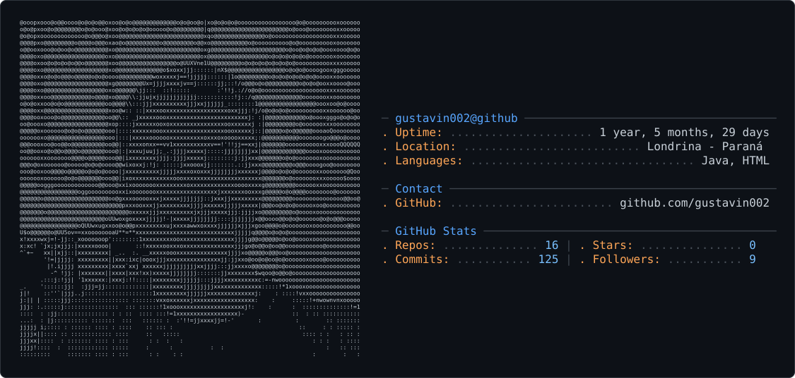

<div align="center">

<picture>
  <source media="(prefers-color-scheme: dark)" srcset="dark_mode.svg" />
  <source media="(prefers-color-scheme: light)" srcset="light_mode.svg" />
  
</picture>

</div>

<div align="center">


<br>

<a href="https://github.com/gustavin002">
  
</a>
<a href="mailto:gustavomaia957@gmail.com">
  
</a>

<br><br>


</div>

## 01 // SOBRE MIM

Olá! 👋 Sou o Gustavo, tenho 20 anos, moro em Londrina-PR e sou desenvolvedor Full Stack em formação, com foco no ecossistema Java no back-end e JavaScript/React no front-end.

Atualmente curso Engenharia de Software na UniFil (1º semestre) e já passei pelo Senai, onde concluí o técnico em Desenvolvimento de Sistemas, além de cursos de aperfeiçoamento em Java Web e Power BI.

Meu objetivo agora é conseguir minha primeira vaga de estágio como desenvolvedor e continuar evoluindo como profissional Full Stack.

<div align="center">

| Campo | Detalhe |
|---|---|
| 👤 Nome | Gustavo Maia da Silva |
| 🎂 Idade | 20 |
| 📍 Localização | Londrina - PR, Brasil |
| 🎯 Área | Full Stack Development |
| ☕ Back-End | Java · Spring Boot · Spring Data JPA |
| 🌐 Front-End | HTML · CSS · JavaScript · Bootstrap 5 · React |
| 🍃 Template Engine | Thymeleaf |
| 🐬 Database | MySQL |
| 🎓 Formação | Engenharia de Software — UniFil (1º semestre) |
| 🟢 Status | Online — buscando estágio |

</div>

> **Missão:** Aprender → Construir → Conseguir meu primeiro estágio 🚀

## 02 // TECH STACK

<div align="center">

💻 BACK-END


<br><br>

🌐 FRONT-END


<br><br>

🗄️ DATABASE


<br><br>

🛠️ DEVELOPMENT TOOLS


</div>

## 03 // CORE SKILLS

<div align="center">

| Área | Tecnologias |
|---|---|
| Back-End | ☕ Java · 🍃 Spring Boot · 🗃️ Spring Data JPA |
| Front-End | 🟨 JavaScript · HTML5 · CSS3 · Bootstrap 5 · React |
| Template Engine | 🍃 Thymeleaf |
| Database | 🐬 MySQL |
| Versionamento | 🔧 Git · GitHub |
| IDE / Editor | 💻 NetBeans |
| Formação | 🎓 Engenharia de Software — UniFil |
| Cursos complementares | 📘 Técnico em Dev. de Sistemas (Senai) · Java Web · Power BI |

</div>

## 04 // FERRAMENTAS

<div align="center">

| Categoria | Ferramenta | Status |
|---|---|---|
| Versionamento | Git | ✅ |
| Versionamento | GitHub | ✅ |
| IDE | NetBeans | ✅ |
| Database | MySQL | ✅ |
| Front-End | Bootstrap 5 | ✅ |
| Back-End | Spring Boot | ✅ |
| Back-End | Spring Data JPA | ✅ |
| Template Engine | Thymeleaf | ✅ |
| Front-End | React | ✅ |

</div>

## 05 // PROJETOS

<div align="center">
<table>
<tr>
<td width="50%" valign="top">

### 📦 Belka PVC — Encomendas (Front-end)

Interface web para gestão de encomendas, desenvolvida como parte de um sistema full stack em dupla com back-end separado.

**Tecnologias:** HTML · CSS · JavaScript · Bootstrap 5

<br>
<a href="https://github.com/gustavin002/projeto-belka-pvc-encomendas-front-end">

</a>

</td>
<td width="50%" valign="top">

### 📦 Belka PVC — Encomendas (Back-end)

API/back-end responsável pelas regras de negócio e persistência de dados do sistema de encomendas Belka PVC.

**Tecnologias:** Java · Spring Boot · Spring Data JPA · MySQL

<br>
<a href="https://github.com/gustavin002/projeto-belka-pvc-encomendas-back-end">

</a>

</td>
</tr>
<tr>
<td width="50%" valign="top" colspan="2">

### 🏥 Sistema Interno de Gestão de Fila Hospitalar (Full Stack)

Sistema para gerenciamento de filas de atendimento hospitalar, unindo front-end e back-end em um só projeto — controle de senhas/atendimento de pacientes.

**Tecnologias:** Java · Spring Boot · Spring Data JPA · Thymeleaf · MySQL · HTML/CSS

<br>
<a href="https://github.com/gustavin002/Sistema-interno-de-gestao-de-fila-hospitalar-back-end-front-end">

</a>

</td>
</tr>
</table>
</div>

## 06 // CURRENT OBJECTIVES

<div align="center">

| Objetivo | Progresso |
|---|---|
| 🎯 Conseguir meu primeiro estágio como desenvolvedor | ███████░░░ 70% |
| ☕ Aprofundar conhecimentos em Java | ██████░░░░ 60% |
| ⚛️ Evoluir em React | ███████░░░ 70% |
| 🐬 Aprofundar conhecimentos em MySQL | █████░░░░░ 50% |
| 🏗️ Praticar arquitetura de projetos full stack | █████░░░░░ 50% |
| 💡 Criar projetos pessoais mais completos | ████░░░░░░ 40% |
| 🎓 Concluir Engenharia de Software (1º semestre) | ███░░░░░░░ 30% |

</div>

> **Próximo alvo:** Conseguir minha primeira oportunidade na área de TI.
> **Status:** 🟢 Aprendendo e construindo

## 07 // GITHUB ANALYTICS

<div align="center">


<br><br>


<br><br>


</div>

## 08 // GITHUB TROPHIES

<div align="center">

</div>

## 09 // CONTRIBUTION MATRIX

<div align="center">
<picture>
  <source media="(prefers-color-scheme: dark)" srcset="https://raw.githubusercontent.com/gustavin002/gustavin002/output/pacman-contribution-graph-dark.svg">
  <source media="(prefers-color-scheme: light)" srcset="https://raw.githubusercontent.com/gustavin002/gustavin002/output/pacman-contribution-graph.svg">
  
</picture>
</div>

## 10 // CONNECT

<div align="center">

<a href="https://github.com/gustavin002">
  
</a>
<a href="mailto:gustavomaia957@gmail.com">
  
</a>

</div>

<br>

<div align="center">

```
╔══════════════════════════════════════════════════════════════╗
║                                                                ║
║     JAVA • SPRING BOOT • REACT • HTML • CSS • MYSQL • THYMELEAF ║
║                                                                ║
║           SOFTWARE ENGINEERING STUDENT @ UNIFIL                ║
║                                                                ║
║                 BUILD. LEARN. EVOLVE. 🚀                       ║
║                                                                ║
╚══════════════════════════════════════════════════════════════╝

SYSTEM STATUS: ONLINE 🟢
"The best way to predict the future is to build it."
```


</div>
